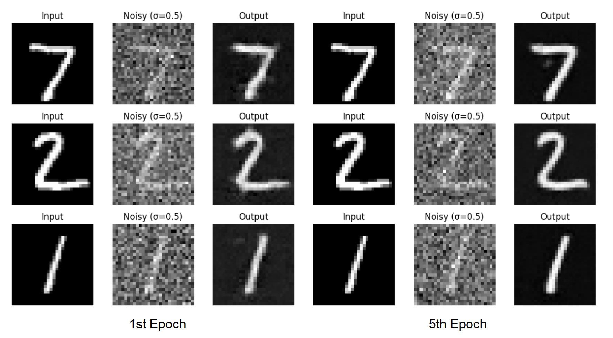
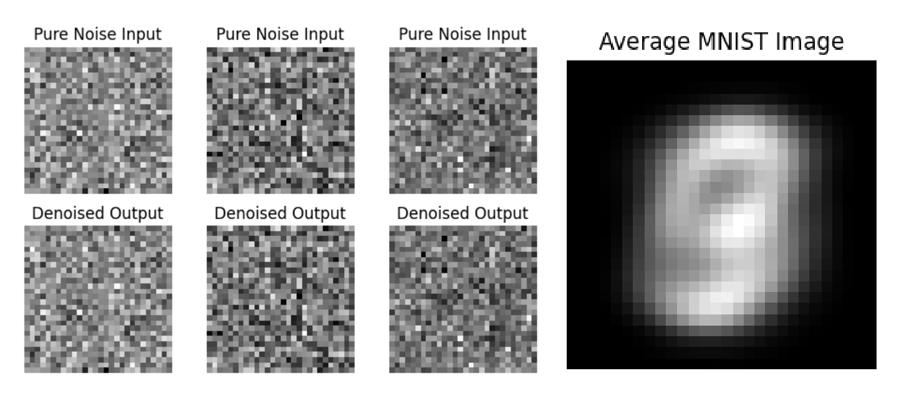
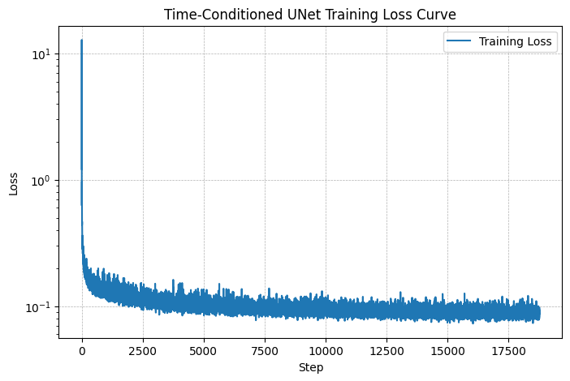
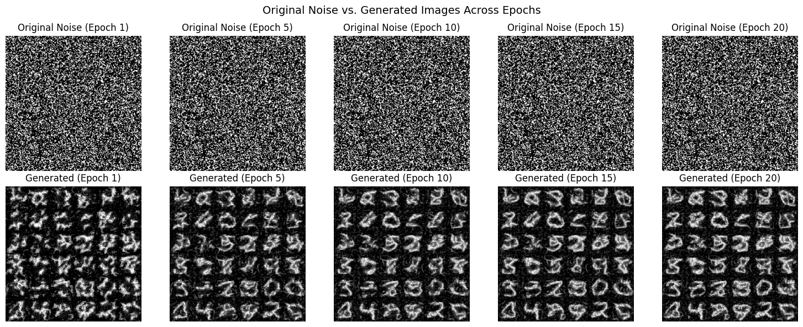
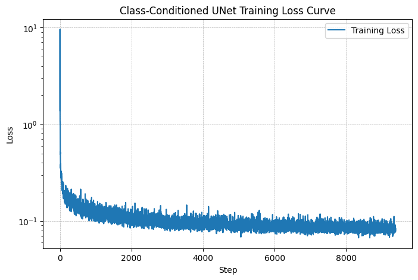
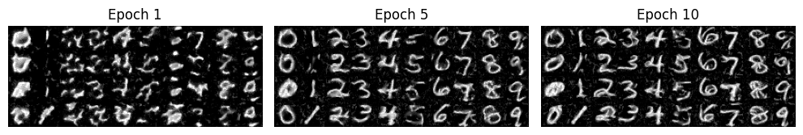

## Overview
This project explores Flow Matching as a generative modeling technique by training a UNet-based denoiser on the MNIST dataset. The model progressively denoises images using flow matching instead of traditional diffusion models. The project includes:
* Single-Step Denoising UNet: Trains a simple UNet to remove noise from images.
* Flow Matching Model: Implements a time-conditioned UNet to iteratively refine noisy images into realistic samples.
* Class-Conditioned Flow Matching (Optional): Enhances generation by incorporating digit labels as conditioning signals.

Using PyTorch and Colab GPUs, the model demonstrates effective image restoration and generation, showcasing flow matching as an efficient alternative to diffusion models.


## Part 1: Training a Single-Step Denoising UNet
Given a noisy image $z$, we aim to train a denoiser such that it maps to a clean image $x$. To do so, we can optimize over an L2 loss:
$$L=E_{z,x}||D_{(\theta)}(z)-x||^2$$

Then, implementing the Unconditional UNet based on the architecture shown below


After the implementation of UNet, we aim to solve the following denoising problem: Given a noisy image $z$, we aim to train a denoiser $D_{(\theta)}(z)$ such that it maps to a clean image $x$. To do so, we can optimize over an L2 loss. To train our denoiser, we need to generate training data pairs of $(z, x)$, where each $x$ is a clean MNIST digit. For each training batch, we can generate $z$ from $x$ using the the following noising process:
$$z=x+\sigma\epsilon, \epsilon\in{N(0, I)}$$
 
Visualize the different noising processes over $\sigma$=[0.0, 0.2, 0.4, 0.5, 0.6, 0.8, 1.0], assuming normalized $x\in[0,1]$.


Now, we will train the model to perform denoising.
* Objective: Train a denoiser to denoise noisy image $z$ with $\sigma=0.5$ applied to a clean image $x$.
* Dataset and dataloader: Use the MNIST dataset via `torchvision.datasets.MNIST` with flags to access training and test sets. Train only on the training set. Shuffle the dataset before creating the dataloader. Recommended batch size: 256. We'll train over our dataset for 5 epochs.
* Model: Use the UNet architecture with recommended hidden dimension `D = 128`.
* Optimizer: Use Adam optimizer with learning rate of 1e-4.

A training loss curve plot every few iterations during the whole training process is shown below


Then, we visualize denoised results on the test set at the end of training. Display sample results after the 1st and 5th epoch.


We performed a Out-of-Distribution Testing. Our denoiser was trained on MNIST digits noised with $\sigma=0.5$. Let's see how the denoiser performs on different $\sigma$'s that it wasn't trained for. Visualize the denoiser results on test set digits with varying levels of noise $\sigma$=[0.0, 0.2, 0.4, 0.5, 0.6, 0.8, 1.0].


We tried to make denoising a generative task, we'd like to be able to denoise pure, random Gaussian noise. We can think of this as starting with a blank canvas $z=\epsilon$ where $\epsilon\in{N(0, I)}$ and denoising it to get a clean image $x$. Repeat the same denoising process as before, but start with pure noise and denoise it for 5 epochs. The model is unable to denoise pure noise into anything meaningful, and one-step denoising does not work well for generative tasks.


Additionally, compute the average image of the training set. When comparing them with the average image, we could kinda see a very vague pattern on the denoised output similar to the average image.

## Part 2: Training a Flow Matching Model
We just saw that one-step denoising does not work well for generative tasks. Instead, we need to iteratively denoise the image, and we will do so with flow matching. Here, we will iteratively denoise an image by training a UNet model to predict the `flow' from our noisy data to clean data. In our flow matching setup, we sample a pure noise image $x_0\sim{N(0,I)}$ and generate a realistic image $x_1$.

For iterative denoising, we need to define how intermediate noisy samples are constructed. The simplest approach would be a linear interpolation between noisy $x_0$ and clean $x_1$ for some $x_1$ in our training data:
$$x_t=(1-t)x_0+tx_1, x_0\sim{N(0,I)}$$

This is a vector field describing the position of a point $x_t$ at time $t$ relative to the clean data distribution $p_1{(x_1)}$ and the noisy data distribution $p_0{(x_0)}$. Intuitively, we see that for small $t$, we remain close to noise, while for larger $t$, we approach the clean distribution.

Flow can be thought of as the velocity (change in posiiton w.r.t. time) of this vector field, describing how to move from $x_0$ to $x_1$:
$$u(x_t,t)=\frac{d}{dt}x_t=x_1-x_0$$

Our aim is to learn a UNet $u_{\theta}(x_t, t)$ which approximates this flow $u(x_t, t)=x_1-x_0$, giving us our learning objective:
$$L=E_{x_0\sim{p_0(x_0)},x_1\sim{p_1(x_1)},t\sim{U[0,1]}}||(x_1-x_0)-u_{\theta}(x_t, t)||^2$$

We need a way to inject scalar $t$ into our UNet model to condition it. There are many ways to do this. Here is what we did to implement **Time conditioned UNet Architecture**. It may look like we're predicting the original image in the figure above, but we are not. We're predicting the flow from the noisy $x_0$ to clean $x_1$, which will contain both parts of the original image as well as the noise to remove. 


We can embed $t$ by following this pseudo code:
```Python
fc1_t = FCBlock(...)
fc2_t = FCBlock(...)

# the t passed in here should be normalized to be in the range [0, 1]
t1 = fc1_t(t)
t2 = fc2_t(t)

# Follow diagram to get unflatten.
# Replace the original unflatten with modulated unflatten.
unflatten = unflatten * t1
# Follow diagram to get up1.
...
# Replace the original up1 with modulated up1.
up1 = up1 * t2
# Follow diagram to get the output.
...
```

More details on how it works, see below:


For the training process:
Basically, we pick a random image from the training set, a random timestep $t$, and train the denoiser to predict the flow at $x_t$. We repeat this for different images and different timesteps until the model converges and we are happy.
* Objective: Train a time-conditioned UNet $u_{\theta}(x_t, t)$ to predict the flow at $x_t$ given a noisy image $x_t$ and a timestep $t$.
* Dataset and dataloader: Use the MNIST dataset via `torchvision.datasets.MNIST` with flags to access training and test sets. Train only on the training set. Shuffle the dataset before creating the dataloader. Recommended batch size: 64.
* Model: Use the time-conditioned UNet architecture defined in section 2.1 with recommended hidden dimension `D = 64`. Follow the diagram and pseudocode for how to inject the conditioning signal $t$ into the UNet. Remember to normalize $t$ before embedding it.
* Optimizer: Use Adam optimizer with an initial learning rate of 1e-2. We will be using an exponential learning rate decay scheduler with a gamma of $0.1^{1.0/num_epochs}$. This can be implemented using `scheduler = torch.optim.lr_scheduler.ExponentialLR(...)`. You should call `scheduler.step()` after every epoch.

The training loss curve plot for the time-conditioned UNet over the whole training process is shown below



We can now use our UNet for iterative denoising using the algorithm below!. Sampling results for the time-conditioned UNet for 5 and 10 epochs.


## Part 3: Adding Class-Conditioning to Time conditioned UNet
To make the results better and give us more control for image generation, we can also optionally condition our UNet on the class of the digit 0-9. This will require adding 2 more FCBlocks to our UNet but, we suggest that for class-conditioning vector $c$, you make it a one-hot vector instead of a single scalar. Because we still want our UNet to work without it being conditioned on the class, we implement dropout where 10% of the time ($p_{uncond}=0.1$) we drop the class conditioning vector $c$ by setting it to 0. Here is one way to condition our UNet $u_{\theta}(x_t, t, c)$ on both time $t$ and class $c$:

We can embed $c$ and $t$ by following this pseudo code:
```python
fc1_t = FCBlock(...)
fc1_c = FCBlock(...)
fc2_t = FCBlock(...)
fc2_c = FCBlock(...)

t1 = fc1_t(t)
c1 = fc1_c(c)
t2 = fc2_t(t)
c2 = fc2_c(c)

# Follow diagram to get unflatten.
# Replace the original unflatten with modulated unflatten.
unflatten = c1 * unflatten + t1
# Follow diagram to get up1.
...
# Replace the original up1 with modulated up1.
up1 = c2 * up1 + t2
# Follow diagram to get the output.
...
```
Training for this section will be the same as time-only, with the only difference being the conditioning vector $c$ and doing unconditional generation periodically. A training loss curve plot for the class-conditioned UNet over the whole training process(10 epochs)


Now we will sample with class-conditioning and will use classifier-free guidance with $\gamma=0.5$. Sampling results for the class-conditioned UNet for 5 and 10 epochs.
