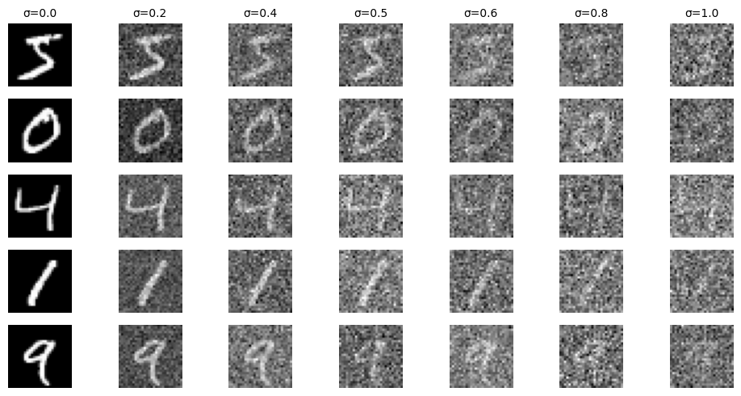
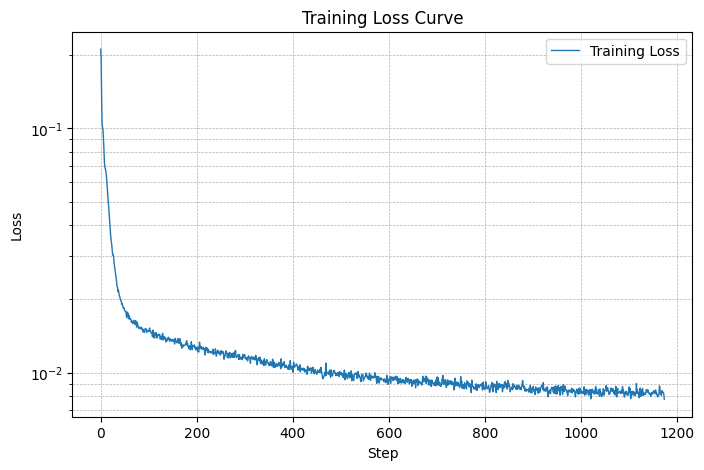
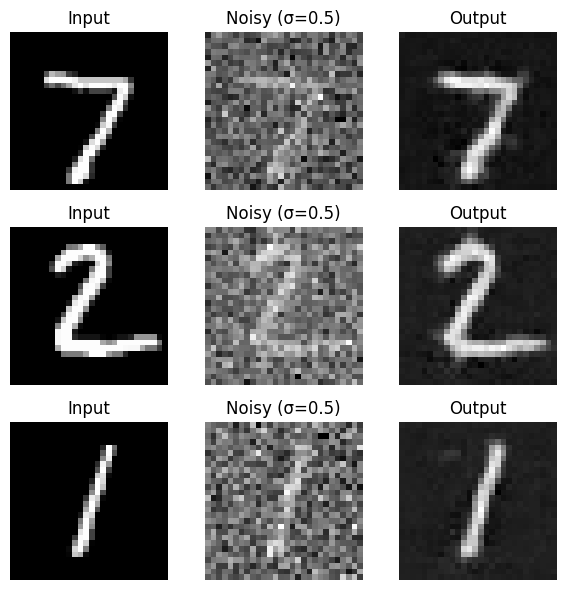
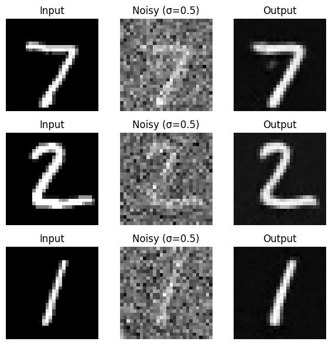
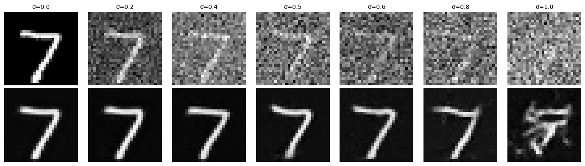
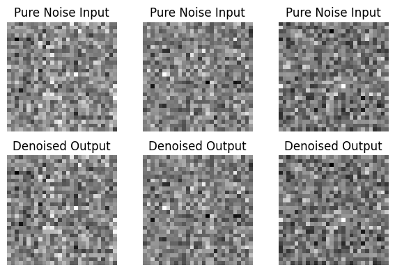
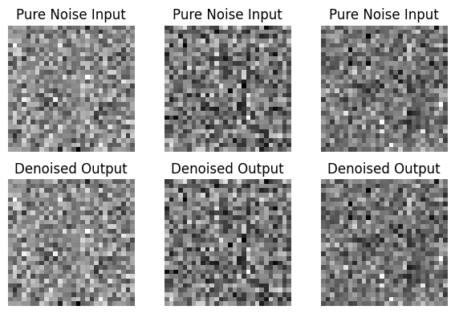
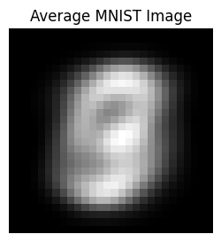

## Part 1: Training a Single-Step Denoising UNet
1. A visualization of the noising process using $\sigma$=[0.0, 0.2, 0.4, 0.5, 0.6, 0.8, 1.0]

2. A training loss curve plot every few iterations during the whole training process

3. Sample results on the test set after the first and the 5-th epoch
    * First epoch
    
        
    * Fifth epoch

        
4. Sample results on the test set with out-of-distribution noise levels after the model is trained. Keep the same image and vary $\sigma$=[0.0, 0.2, 0.4, 0.5, 0.6, 0.8, 1.0]

5. Sample results on the test set with pure noise $\epsilon\sim{N(0,I)}$
    * First epoch
        
        
    * Fifth epoch 
    
        
6. Average image of the training set along with a brief description comparing it to the denoising results.
